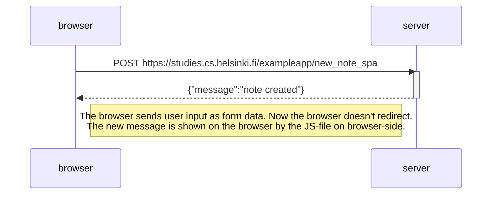

```mermaid
sequenceDiagram
  participant browser
  participant server

  browser ->>server: POST https://studies.cs.helsinki.fi/exampleapp/new_note_spa
  activate server
  server -->>browser: {"message":"note created"}
  deactivate server

  Note right of browser: The browser sends user input as form data. Now the browser doesn't redirect. <br> The new message is shown on the browser by the JS-file on browser-side.

  
```
