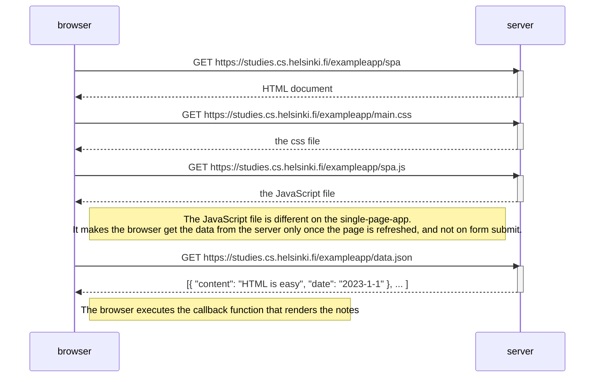

```mermaid
sequenceDiagram
  participant browser
  participant server

  browser ->>server: GET https://studies.cs.helsinki.fi/exampleapp/spa
  activate server
  server -->>browser: HTML document
  deactivate server

  browser ->>server: GET https://studies.cs.helsinki.fi/exampleapp/main.css
  activate server
  server -->>browser: the css file
  deactivate server

  browser ->>server: GET https://studies.cs.helsinki.fi/exampleapp/spa.js
  activate server
  server -->>browser: the JavaScript file
  deactivate server

  note right of browser: The JavaScript file is different on the single-page-app. <br> It makes the browser get the data from the server only once the page is refreshed, and not on form submit.

  browser->>server: GET https://studies.cs.helsinki.fi/exampleapp/data.json
  activate server
  server-->>browser: [{ "content": "HTML is easy", "date": "2023-1-1" }, ... ]
  deactivate server

  note right of browser: The browser executes the callback function that renders the notes


```
